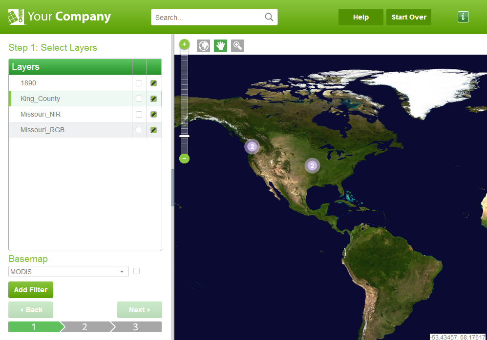

README
=======

This is an example of changing styles for the ExpressZip application. For information on building and deploying ExpressZip, see the [main branch](https://github.com/lizardtechblog/ExpressZip). For a detailed look at which files you have to edit to change styles, see the [branch comparison](https://github.com/lizardtechblog/ExpressZip/compare/master...styles). 

You can view the result of the style changes in the following figure:



The styling information for ExpressZip is contained in the following directory:
```
WebContent/VAADIN/themes/ExpressZip
```
To change the logo, you can either replace the ExpZip_Logo161x33px.png file with your own logo, or you can edit the embedded logo line in the following file:
```
/src/com/lizardtech/expresszip/vaadin/MapToolbarViewComponent.java
```
For example, you might change the line to point to the following custom logo file:
```
Embedded logo = new Embedded(null, new ThemeResource("img/Custom_Logo.png"));
```
Tip: Some buttons and panels are stored as images. To change the colors of images, you can open the images in an image manipulation program like [GIMP](http://www.gimp.org/) and edit the hue and saturation values.
